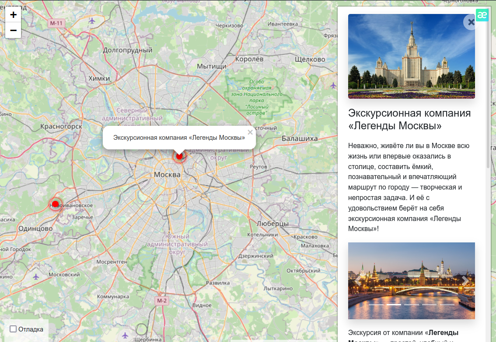

# Куда пойти

*Веб-приложение, которое покажет тебе на карте самые красивые и необычные места поблизости, о которых ты, возможно, даже и не подозревал. Конечно же, ты можешь добавить свои любимые локации. Фотографии и описание, удобная навигация - всё для того, чтобы провести время с пользой.*

Демо-версия: http://tolegu.pythonanywhere.com/

Добавление новых локаций, фотографий и описаний ты можешь осуществлять через удобную админку, она здесь: http://tolegu.pythonanywhere.com/admin/

Попробуй себя в качестве редактора сайта:

    Логин: Irina
    Пароль: EEXxzRNU

Но если новых локаций много, то лучше воспользоваться автоматизированной загрузкой, см. ниже в разделе Загрузка данных.

## Установка

Приложение является свободным, ты можешь установить его и пользоваться. Для этого тебе понадобятся:
1. Python 3.6+ [см. как установить (англ.)](https://realpython.com/installing-python/), а [здесь для Debian-based (рус.)](http://userone.ru/?q=node/41).
2. Django 3.x [см. как установить (рус.)](https://developer.mozilla.org/ru/docs/Learn/Server-side/Django/development_environment).

Далее, скачай репозиторий к себе, установи и активируй виртуальное окружение: 

    python3 -m venv env
    source env/bin/activate

установи необходимые библиотеки для Django, указанные в файле requirements.txt:

    pip install -r requirements.txt

запусти сайт:

    ./manage.py runserver

и открой его в браузере, указав в адресной строке (главная страница или административная панель):

    http://127.0.0.1:8000
    http://127.0.0.1:8000/admin

Фронтенд представляет собой готовый шаблон. В качестве карты используется [Openstreetmap](https://www.openstreetmap.org). Для работы шаблона используются следующие javascript- и css-библиотеки:
* [Leaflet](https://leafletjs.com/) — отрисовка карты
* [loglevel](https://www.npmjs.com/package/loglevel) для логгирования
* [Bootstrap](https://getbootstrap.com/) — CSS библиотека
* [Vue.js](https://ru.vuejs.org/) — реактивные шаблоны на фронтенде

Всё включено и настроено :)

## Загрузка данных

Загрузку значительного количества данных можно осуществить с помощью менеджера Django и команды load_place. Для этого необходимо подготовить JSON-файл с данными о локации, фотографии для этой локации и разместить эти файлы на каком-нибудь файловом хостинге, например, на Github. Вот как должен выглядеть JSON-файл:

    {
    "title": "Заголовок",
    "imgs": [
        "URL картинки 1",
        "URL картинки 2",
    ],
    "description_short": "Краткое описание",
    "description_long": "Детальное описание",
    "coordinates": {
        "lng": "37.53484000000032",
        "lat": "55.74998119999979"
                   }
    }

Далее, следует зайти на сервер в папку с проектом, активировать виртуальное окружнение и запустить команду

    ./manage.py load_place <URL JSON-файла>

Данная команда загрузит локацию в базу данных, а также скачает и подключит картинки из списка "imgs". 

## Роли

### Администратор сайта

Администратор сайта является суперпользователем, имеет все права в отношении контента. На [демо-сайте](http://tolegu.pythonanywhere.com/) авторизуйся со следующими данными:

    Логин: admin
    Пароль: uyUEoeNz

### Контент-менеджер/Редактор

Редактор сайта может обновлять записи, добавлять новые или удалять старые. Остальные функции ему просто не нужны. 
Данные для входа на [демо-сайт](http://tolegu.pythonanywhere.com/) в качестве радактора:

    Логин: Irina
    Пароль: EEXxzRNU

## Цели проекта

Код написан в учебных целях — это урок в курсе по Python и веб-разработке на сайте [Devman](https://dvmn.org).

Тестовые данные взяты с сайта [KudaGo](https://kudago.com).

